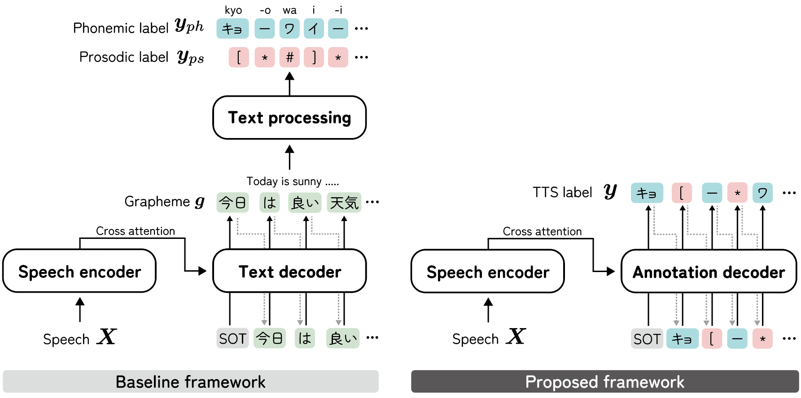

<!--
# Authors
- Yuma Shirahata
- Byeongseon Park
- Ryuichi Yamamoto
- Kentaro Tachibana
-->

# Paper
- Submitted to INTERSPEECH 2024
- arXiv: TBD

# Abstract

This paper proposes an audio-conditioned phonemic and prosodic annotation model for building text-to-speech (TTS) datasets from unlabeled speech samples.
For creating a TTS dataset that consists of label-speech paired data, the proposed annotation model leverages an automatic speech recognition (ASR) model to obtain phonemic and prosodic labels from unlabeled speech samples.
By fine-tuning a large-scale pre-trained ASR model, we can construct the annotation model using a limited amount of label-speech paired data within an existing TTS dataset.
To alleviate the shortage of label-speech paired data for training the annotation model, we generate pseudo label-speech paired data using text-only corpora and an auxiliary TTS model. This TTS model is also trained with the existing TTS dataset.
Experimental results show that the TTS model trained with the dataset created by the proposed annotation method can synthesize speech as naturally as the one trained with a fully-labeled dataset.

# Audio samples (Japanese)

## JSUT [1]

Sample 1: **"投網による漁を提案する度に、彼は反抗した。"**

(Phoneme sequence in alphabet: **"na ge a mi ni yo ru ryoo o tee aN su ru ta bi ni, ka re wa haN koo shi ta."**)

| Model            | Audio             |
|------------------|:--------------------:|
| **Reference** | <audio controls src="data/samples/JSUT/Reference/BASIC5000_4770.wav"></audio> |
| **ORACLE** | <audio controls src="data/samples/JSUT/ORACLE/BASIC5000_4770.wav"></audio> |
| **ORACLE-WO-ACC** | <audio controls src="data/samples/JSUT/ORACLE-WO-ACC/BASIC5000_4770.wav"></audio> |
| **ASR-NLP** | <audio controls src="data/samples/JSUT/ASR-NLP/BASIC5000_4770.wav"></audio> |
| **GT-NLP** | <audio controls src="data/samples/JSUT/GT-NLP/BASIC5000_4770.wav"></audio> |
| **ANNT-LARGE** | <audio controls src="data/samples/JSUT/ANNT-LARGE/BASIC5000_4770.wav"></audio> |

Sample 2: **"この老舗の名物は、地元の小豆を使った月餅です。"**

(Phoneme sequence in alphabet: **"ko no shi ni se no mee bu tsu wa, ji mo to no, a zu ki o tsu kaQ ta geQ pee de su."**)

| Model            | Audio             |
|------------------|:--------------------:|
| **Reference** | <audio controls src="data/samples/JSUT/Reference/BASIC5000_4807.wav"></audio> |
| **ORACLE** | <audio controls src="data/samples/JSUT/ORACLE/BASIC5000_4807.wav"></audio> |
| **ORACLE-WO-ACC** | <audio controls src="data/samples/JSUT/ORACLE-WO-ACC/BASIC5000_4807.wav"></audio> |
| **ASR-NLP** | <audio controls src="data/samples/JSUT/ASR-NLP/BASIC5000_4807.wav"></audio> |
| **GT-NLP** | <audio controls src="data/samples/JSUT/GT-NLP/BASIC5000_4807.wav"></audio> |
| **ANNT-LARGE** | <audio controls src="data/samples/JSUT/ANNT-LARGE/BASIC5000_4807.wav"></audio> |

## JVS [2]

Sample 1: **"しかし、作品の結末は智恵と洞察に満ちた回答というより、より、入り組んだ挫折と、混迷の荒野に、読者を連れ戻すものではなかったか。"**

(Phoneme sequence in alphabet: **"shi ka shi, sa ku hiN no ke tsu ma tsu wa, chi e to doo sa tsu ni mi chi ta ka i too to yuu yo ri, yo ri, i ri kuN da za se tsu to, koN mee no koo ya ni, do ku shya o tsu re mo do su mo no de wa na kaQ ta ka."**)

| Model            | Audio             |
|------------------|:--------------------:|
| **Reference** | <audio controls src="data/samples/JVS/Reference/jvs009_UT-PARAPHRASE-sent273-phrase1.wav"></audio> |
| **GT-NLP-WO-ACC** | <audio controls src="data/samples/JVS/GT-NLP-WO-ACC/jvs009_UT-PARAPHRASE-sent273-phrase1.wav"></audio> |
| **ASR-NLP** | <audio controls src="data/samples/JVS/ASR-NLP/jvs009_UT-PARAPHRASE-sent273-phrase1.wav"></audio> |
| **GT-NLP** | <audio controls src="data/samples/JVS/GT-NLP/jvs009_UT-PARAPHRASE-sent273-phrase1.wav"></audio> |
| **ANNT-JSUT** | <audio controls src="data/samples/JVS/ANNT-JSUT/jvs009_UT-PARAPHRASE-sent273-phrase1.wav"></audio> |
| **ANNT-JSUT-TTSAUG** | <audio controls src="data/samples/JVS/ANNT-JSUT-TTSAUG/jvs009_UT-PARAPHRASE-sent273-phrase1.wav"></audio> |
| **ANNT-LARGE** | <audio controls src="data/samples/JVS/ANNT-LARGE/jvs009_UT-PARAPHRASE-sent273-phrase1.wav"></audio> |

Sample 2: **"その後、手紙を出した相手の方々に会ったが、誰もが何食わぬ顔で、季節の挨拶をしてくれて私はほっとした。"**

(Phoneme sequence in alphabet: **"so no go, te ga mi o da shi ta a i te no ka ta ga ta ni aQ ta ga, da re mo ga na ni ku wa nu ka o de, ki se tsu no a i sa tsu o shi te ku re te, wa ta shi wa hoQ to shi ta."**)

| Model            | Audio             |
|------------------|:--------------------:|
| **Reference** | <audio controls src="data/samples/JVS/Reference/jvs061_UT-PARAPHRASE-sent286-phrase2.wav"></audio> |
| **GT-NLP-WO-ACC** | <audio controls src="data/samples/JVS/GT-NLP-WO-ACC/jvs061_UT-PARAPHRASE-sent286-phrase2.wav"></audio> |
| **ASR-NLP** | <audio controls src="data/samples/JVS/ASR-NLP/jvs061_UT-PARAPHRASE-sent286-phrase2.wav"></audio> |
| **GT-NLP** | <audio controls src="data/samples/JVS/GT-NLP/jvs061_UT-PARAPHRASE-sent286-phrase2.wav"></audio> |
| **ANNT-JSUT** | <audio controls src="data/samples/JVS/ANNT-JSUT/jvs061_UT-PARAPHRASE-sent286-phrase2.wav"></audio> |
| **ANNT-JSUT-TTSAUG** | <audio controls src="data/samples/JVS/ANNT-JSUT-TTSAUG/jvs061_UT-PARAPHRASE-sent286-phrase2.wav"></audio> |
| **ANNT-LARGE** | <audio controls src="data/samples/JVS/ANNT-LARGE/jvs061_UT-PARAPHRASE-sent286-phrase2.wav"></audio> |

## LARGE

Sample 1: **"スープといっしょに、にんじん、じゃがいも、たまねぎ、豚肉を、なべに入れます。"**

(Phoneme sequence in alphabet: **"suu pu to iQ shyo ni, niN jiN, jya ga i mo, ta ma ne gi, bu ta ni ku o, na be ni i re ma su."**)

| Model            | Audio             |
|------------------|:--------------------:|
| **Reference** | <audio controls src="data/samples/LARGE/Reference/fisk03879.wav"></audio> |
| **ORACLE** | <audio controls src="data/samples/LARGE/ORACLE/fisk03879.wav"></audio> |
| **ORACLE-WO-ACC** | <audio controls src="data/samples/LARGE/ORACLE-WO-ACC/fisk03879.wav"></audio> |
| **ASR-NLP** | <audio controls src="data/samples/LARGE/ASR-NLP/fisk03879.wav"></audio> |
| **GT-NLP** | <audio controls src="data/samples/LARGE/GT-NLP/fisk03879.wav"></audio> |
| **ANNT-JSUT** | <audio controls src="data/samples/LARGE/ANNT-JSUT/fisk03879.wav"></audio> |
| **ANNT-JSUT-TTSAUG** | <audio controls src="data/samples/LARGE/ANNT-JSUT-TTSAUG/fisk03879.wav"></audio> |
| **ANNT-LARGE** | <audio controls src="data/samples/LARGE/ANNT-LARGE/fisk03879.wav"></audio> |

Sample 2: **"まあ、ここは都心にも近いし、おしゃれな街だっていうことで、若い夫婦にはすごい人気があるらしいですよ。"**

(Phoneme sequence in alphabet: **"maa, ko ko wa to shiN ni mo chi ka i shi, o shya re na ma chi daQ te yuu ko to de, wa ka i fuu fu ni wa su go i niN ki ga a ru ra shii de su yo."**)

| Model            | Audio             |
|------------------|:--------------------:|
| **Reference** | <audio controls src="data/samples/LARGE/Reference/mksk03850.wav"></audio> |
| **ORACLE** | <audio controls src="data/samples/LARGE/ORACLE/mksk03850.wav"></audio> |
| **ORACLE-WO-ACC** | <audio controls src="data/samples/LARGE/ORACLE-WO-ACC/mksk03850.wav"></audio> |
| **ASR-NLP** | <audio controls src="data/samples/LARGE/ASR-NLP/mksk03850.wav"></audio> |
| **GT-NLP** | <audio controls src="data/samples/LARGE/GT-NLP/mksk03850.wav"></audio> |
| **ANNT-JSUT** | <audio controls src="data/samples/LARGE/ANNT-JSUT/mksk03850.wav"></audio> |
| **ANNT-JSUT-TTSAUG** | <audio controls src="data/samples/LARGE/ANNT-JSUT-TTSAUG/mksk03850.wav"></audio> |
| **ANNT-LARGE** | <audio controls src="data/samples/LARGE/ANNT-LARGE/mksk03850.wav"></audio> |

# References
- [1]: Ryosuke Sonobe, Shinnosuke Takamichi and Hiroshi Saruwatari,  "JSUT corpus: free large-scale Japanese speech corpus for end-to-end speech synthesis," arXiv preprint, 1711.00354, 2017.
- [2]: Shinnosuke Takamichi, Kentaro Mitsui, Yuki Saito, Tomoki Koriyama, Naoko Tanji, and Hiroshi Saruwatari, "JVS corpus: free Japanese multi-speaker voice corpus," arXiv preprint, 1908.06248, Aug. 2019.
